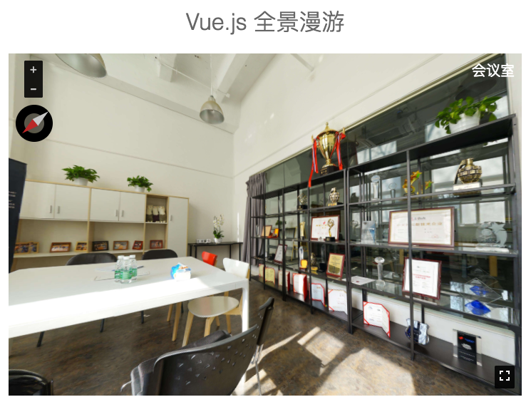
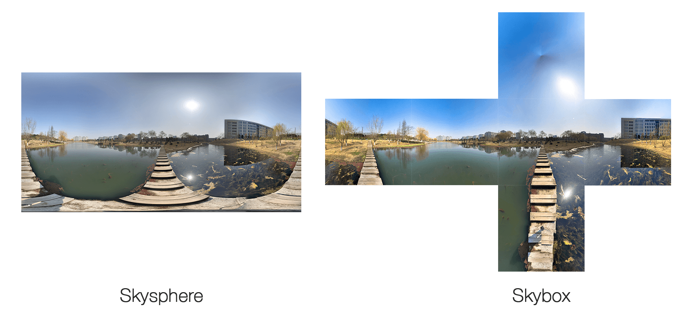

# vue-pano

WebGL panorama component for vue.js



Click this link or scan the QRCode on your mobile devices to see the demo:

https://chichou.github.io/vue-pano/


## Usage

### The image

You can use [PhotoSphere App from Google](https://www.google.com/streetview/apps/) to take a panorama with a smartphone (both Android and iOS)! Since it results in a equirectangular projection skysphere image (only one rectangular), and the vue-pano only supports the skybox format (six squares), you need to convert the image using this tiny tool I wrote: [glskybox](https://github.com/ChiChou/glskybox).



If you are not satisified with the camera on mobile, or you need to take the pircure indoor, you can follow the [instruction here (in Chinese)](https://blog.chichou.me/microsoft-ice-%E5%88%B6%E4%BD%9C%E5%85%A8%E6%99%AF%E7%85%A7%E7%89%87-af114142745d) about how to use the full frame camera with a wide angle lens, and compose these pictures into a panorama with [Microsoft ICE](http://research.microsoft.com/en-us/um/redmond/projects/ice/).

### The code

Directly use the build.js can produce a panorama view with a simple html tag:

```javascript
<pano title="长亭科技前台" width="720" height="480" bundle="assets/pano/reception/" format="jpg"></pano>
<pano title="茶水间" width="720" height="480" bundle="assets/pano/pantry/" format="jpg"></pano>
```

Also, you can import the component to your vue project.

```javascript
<script>
import Pano from 'vue-pano'

...

export default {
  components: { Pano }
}
<script>
```

Available props are:

* width, height: the size of the component
* title: the title
* bundle: base path for the six textures
* format: extension of the texture images, like `jpg`
* debug: boolean, is debugging

## Build Setup

``` bash
# install dependencies
yarn

# serve with hot reload at localhost:8080
yarn run dev

# build for production with minification
yarn run build
```

## License

MIT